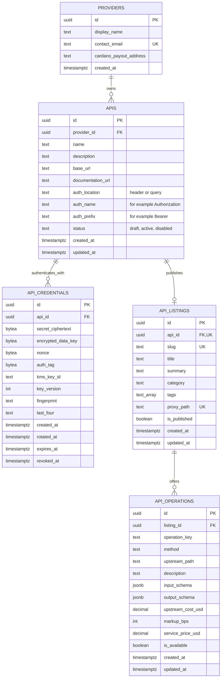

# KeyCard database schema

## Security boundary

- Encrypt API keys in the server with envelope encryption backed by a KMS; never store plaintext keys.
- Give only the proxy service access to `API_CREDENTIALS`.
- Public listing responses must exclude `API_CREDENTIALS`, `APIS.base_url`, authentication fields, and `API_OPERATIONS.upstream_path`.
- Keep previous credential rows as revoked during key rotation; allow only one active credential per API.
